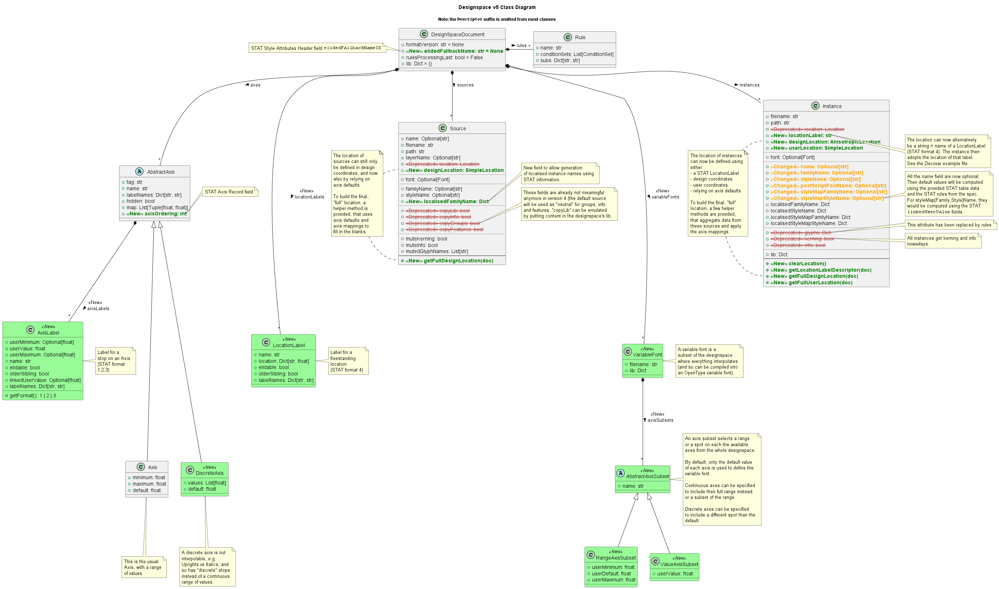

################################
1 DesignSpaceDocument Python API
################################

An object to read, write and edit interpolation systems for typefaces.
Define sources, axes, rules, variable fonts and instances.

Get an overview of the available classes in the Class Diagram below:

   UML class diagram of designspaceLib. Click to enlarge.

.. contents:: Table of contents
   :local:

.. _designspacedocument-object:

===================
DesignSpaceDocument
===================

.. autoclass:: fontTools.designspaceLib::DesignSpaceDocument
   :members:
   :undoc-members:
   :member-order: bysource

.. _axis-descriptor-object:

AxisDescriptor
==============

.. autoclass:: fontTools.designspaceLib::AxisDescriptor
   :members:
   :undoc-members:
   :inherited-members: SimpleDescriptor
   :member-order: bysource

DiscreteAxisDescriptor
======================

.. autoclass:: fontTools.designspaceLib::DiscreteAxisDescriptor
   :members:
   :undoc-members:
   :inherited-members: SimpleDescriptor
   :member-order: bysource

AxisLabelDescriptor
-------------------

.. autoclass:: fontTools.designspaceLib::AxisLabelDescriptor
   :members:
   :undoc-members:
   :member-order: bysource

LocationLabelDescriptor
=======================

.. autoclass:: fontTools.designspaceLib::LocationLabelDescriptor
   :members:
   :undoc-members:
   :member-order: bysource

RuleDescriptor
==============

.. autoclass:: fontTools.designspaceLib::RuleDescriptor
   :members:
   :undoc-members:
   :member-order: bysource

Evaluating rules
----------------

.. autofunction:: fontTools.designspaceLib::evaluateRule
.. autofunction:: fontTools.designspaceLib::evaluateConditions
.. autofunction:: fontTools.designspaceLib::processRules

.. _source-descriptor-object:

SourceDescriptor
================

.. autoclass:: fontTools.designspaceLib::SourceDescriptor
   :members:
   :undoc-members:
   :member-order: bysource

VariableFontDescriptor
======================

.. autoclass:: fontTools.designspaceLib::VariableFontDescriptor
   :members:
   :undoc-members:
   :member-order: bysource

RangeAxisSubsetDescriptor
-------------------------

.. autoclass:: fontTools.designspaceLib::RangeAxisSubsetDescriptor
   :members:
   :undoc-members:
   :member-order: bysource

ValueAxisSubsetDescriptor
-------------------------

.. autoclass:: fontTools.designspaceLib::ValueAxisSubsetDescriptor
   :members:
   :undoc-members:
   :member-order: bysource

.. _instance-descriptor-object:

InstanceDescriptor
==================

.. autoclass:: fontTools.designspaceLib::InstanceDescriptor
   :members:
   :undoc-members:
   :member-order: bysource

.. _subclassing-descriptors:

=======================
Subclassing descriptors
=======================

The DesignSpaceDocument can take subclassed Reader and Writer objects.
This allows you to work with your own descriptors. You could subclass
the descriptors. But as long as they have the basic attributes the
descriptor does not need to be a subclass.

.. code:: python

    class MyDocReader(BaseDocReader):
        axisDescriptorClass = MyAxisDescriptor
        discreteAxisDescriptorClass = MyDiscreteAxisDescriptor
        axisLabelDescriptorClass = MyAxisLabelDescriptor
        locationLabelDescriptorClass = MyLocationLabelDescriptor
        ruleDescriptorClass = MyRuleDescriptor
        sourceDescriptorClass = MySourceDescriptor
        variableFontsDescriptorClass = MyVariableFontDescriptor
        valueAxisSubsetDescriptorClass = MyValueAxisSubsetDescriptor
        rangeAxisSubsetDescriptorClass = MyRangeAxisSubsetDescriptor
        instanceDescriptorClass = MyInstanceDescriptor

    class MyDocWriter(BaseDocWriter):
        axisDescriptorClass = MyAxisDescriptor
        discreteAxisDescriptorClass = MyDiscreteAxisDescriptor
        axisLabelDescriptorClass = MyAxisLabelDescriptor
        locationLabelDescriptorClass = MyLocationLabelDescriptor
        ruleDescriptorClass = MyRuleDescriptor
        sourceDescriptorClass = MySourceDescriptor
        variableFontsDescriptorClass = MyVariableFontDescriptor
        valueAxisSubsetDescriptorClass = MyValueAxisSubsetDescriptor
        rangeAxisSubsetDescriptorClass = MyRangeAxisSubsetDescriptor
        instanceDescriptorClass = MyInstanceDescriptor

    myDoc = DesignSpaceDocument(MyDocReader, MyDocWriter)

==============
Helper modules
==============

fontTools.designspaceLib.split
==============================

See :ref:`Scripting > Working with DesignSpace version 5 <working_with_v5>`
for more information.

.. automodule:: fontTools.designspaceLib.split

fontTools.varLib.stat
=============================

.. automodule:: fontTools.varLib.stat

fontTools.designspaceLib.statNames
==================================

.. automodule:: fontTools.designspaceLib.statNames
