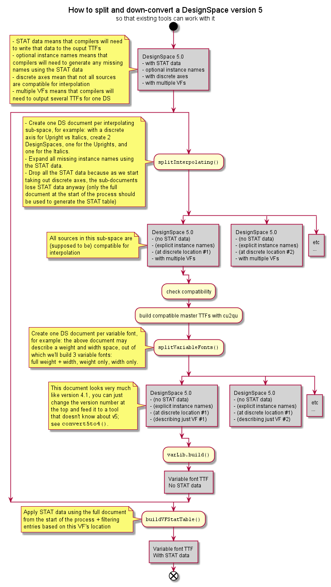

#########################
3 Scripting a designspace
#########################

It can be useful to build a designspace with a script rather than
construct one with an interface like
`Superpolator <http://superpolator.com>`__ or
`DesignSpaceEditor <https://github.com/LettError/designSpaceRoboFontExtension>`__.

`fontTools.designspaceLib` offers a some tools for building designspaces in
Python. This document shows an example.

********************************
Filling-in a DesignSpaceDocument
********************************

So, suppose you installed the `fontTools` package through your favorite
``git`` client.

The ``DesignSpaceDocument`` object represents the document, whether it
already exists or not. Make a new one:

.. code:: python

    from fontTools.designspaceLib import (DesignSpaceDocument, AxisDescriptor,
                                          SourceDescriptor, InstanceDescriptor)
    doc = DesignSpaceDocument()

We want to create definitions for axes, sources and instances. That
means there are a lot of attributes to set. The **DesignSpaceDocument
object** uses objects to describe the axes, sources and instances. These
are relatively simple objects, think of these as collections of
attributes.

-  Attributes of the :ref:`source-descriptor-object`
-  Attributes of the :ref:`instance-descriptor-object`
-  Attributes of the :ref:`axis-descriptor-object`
-  Read about :ref:`subclassing-descriptors`

Make an axis object
===================

Make a descriptor object and add it to the document.

.. code:: python

    a1 = AxisDescriptor()
    a1.maximum = 1000
    a1.minimum = 0
    a1.default = 0
    a1.name = "weight"
    a1.tag = "wght"
    doc.addAxis(a1)

-  You can add as many axes as you need. OpenType has a maximum of
   around 64K. DesignSpaceEditor has a maximum of 5.
-  The ``name`` attribute is the name you'll be using as the axis name
   in the locations.
-  The ``tag`` attribute is the one of the registered `OpenType
   Variation Axis
   Tags <https://www.microsoft.com/typography/otspec/fvar.htm#VAT>`__
-  The default master is expected at the intersection of all
   default values of all axes.

Option: add label names
-----------------------

The **labelnames** attribute is intended to store localisable, human
readable names for this axis if this is not an axis that is registered
by OpenType. Think "The label next to the slider". The attribute is a
dictionary. The key is the `xml language
tag <https://www.w3.org/International/articles/language-tags/>`__, the
value is a ``unicode`` string with the name. Whether or not this attribute is
used depends on the font building tool, the operating system and the
authoring software. This, at least, is the place to record it.

.. code:: python

    a1.labelNames['fa-IR'] = u"قطر"
    a1.labelNames['en'] = u"Wéíght"

Option: add a map
-----------------

The **map** attribute is a list of (input, output) mapping values
intended for `axis variations table of
OpenType <https://www.microsoft.com/typography/otspec/avar.htm>`__.

.. code:: python

    # (user space, design space), (user space, design space)...
    a1.map = [(0.0, 10.0), (401.0, 66.0), (1000.0, 990.0)]

Make a source object
====================

A **source** is an object that points to a UFO file. It provides the
outline geometry, kerning and font.info that we want to work with.

.. code:: python

    s0 = SourceDescriptor()
    s0.path = "my/path/to/thin.ufo"
    s0.name = "master.thin"
    s0.location = dict(weight=0)
    doc.addSource(s0)

-  You'll need to have at least 2 sources in your document, so go ahead
   and add another one.
-  The **location** attribute is a dictionary with the designspace
   location for this master.
-  The axis names in the location have to match one of the ``axis.name``
   values you defined before.
-  The **path** attribute is the absolute path to an existing UFO.
-  The **name** attribute is a unique name for this source used to keep
   track it.
-  The **layerName** attribute is the name of the UFO3 layer. Default None for ``foreground``.

So go ahead and add another master:

.. code:: python

    s1 = SourceDescriptor()
    s1.path = "my/path/to/bold.ufo"
    s1.name = "master.bold"
    s1.location = dict(weight=1000)
    doc.addSource(s1)

Option: exclude glyphs
----------------------

By default all glyphs in a source will be processed. If you want to
exclude certain glyphs, add their names to the ``mutedGlyphNames`` list.

.. code:: python

    s1.mutedGlyphNames = ["A.test", "A.old"]

Make an instance object
=======================

An **instance** is description of a UFO that you want to generate with
the designspace. For an instance you can define more things. If you want
to generate UFO instances with MutatorMath then you can define different
names and set flags for if you want to generate kerning and font info
and so on. You can also set a path where to generate the instance.

.. code:: python

    i0 = InstanceDescriptor()
    i0.familyName = "MyVariableFontPrototype"
    i0.styleName = "Medium"
    i0.path = os.path.join(root, "instances","MyVariableFontPrototype-Medium.ufo")
    i0.location = dict(weight=500)
    i0.kerning = True
    i0.info = True
    doc.addInstance(i0)

-  The ``path`` attribute needs to be the absolute (real or intended)
   path for the instance. When the document is saved this path will
   written as relative to the path of the document.
-  instance paths should be on the same level as the document, or in a
   level below.
-  Instances for MutatorMath will generate to UFO.
-  Instances for variable fonts become **named instances**.

Option: add more names
----------------------

If you want you can add a PostScript font name, a stylemap familyName
and a stylemap styleName.

.. code:: python

    i0.postScriptFontName = "MyVariableFontPrototype-Medium"
    i0.styleMapFamilyName = "MyVarProtoMedium"
    i0.styleMapStyleName = "regular"

Option: add glyph specific masters
----------------------------------

This bit is not supported by OpenType variable fonts, but it is needed
for some designspaces intended for generating instances with
MutatorMath. The code becomes a bit verbose, so you're invited to wrap
this into something clever.

.. code:: python

    # we're making a dict with all sorts of
    #(optional) settings for a glyph.
    #In this example: the dollar.
    glyphData = dict(name="dollar", unicodeValue=0x24)

    # you can specify a different location for a glyph
    glyphData['instanceLocation'] = dict(weight=500)

    # You can specify different masters
    # for this specific glyph.
    # You can also give those masters new
    # locations. It's a miniature designspace.
    # Remember the "name" attribute we assigned to the sources?
    glyphData['masters'] = [
        dict(font="master.thin",
            glyphName="dollar.nostroke",
            location=dict(weight=0)),
        dict(font="master.bold",
            glyphName="dollar.nostroke",
            location=dict(weight=1000)),
        ]

    # With all of that set up, store it in the instance.
    i4.glyphs['dollar'] = glyphData

******
Saving
******

.. code:: python

    path = "myprototype.designspace"
    doc.write(path)

***********
Generating?
***********

You can generate the UFOs with MutatorMath:

.. code:: python

    from mutatorMath.ufo import build
    build("whatevs/myprototype.designspace")

-  Assuming the outline data in the masters is compatible.

Or you can use the file in making a **variable font** with varLib.

.. _working_with_v5:

**********************************
Working with DesignSpace version 5
**********************************

The new version 5 allows "discrete" axes, which do not interpolate across their
values. This is useful to store in one place family-wide data such as the STAT
information, however it prevents the usual things done on designspaces that
interpolate everywhere:

- checking that all sources are compatible for interpolation
- building variable fonts

In order to allow the above in tools that want to handle designspace v5,
the :mod:`fontTools.designspaceLib.split` module provides two methods to
split a designspace into interpolable sub-spaces,
:func:`splitInterpolable() <fontTools.designspaceLib.split.splitInterpolable>`
and then
:func:`splitVariableFonts() <fontTools.designspaceLib.split.splitVariableFonts>`.

   Example process process to check and build Designspace 5.

Also, for older tools that don't know about the other version 5 additions such
as the STAT data fields, the function
:func:`convert5to4() <fontTools.designspaceLib.split.convert5to4>` allows to
strip new information from a designspace version 5 to downgrade it to a
collection of version 4 documents, one per variable font.
