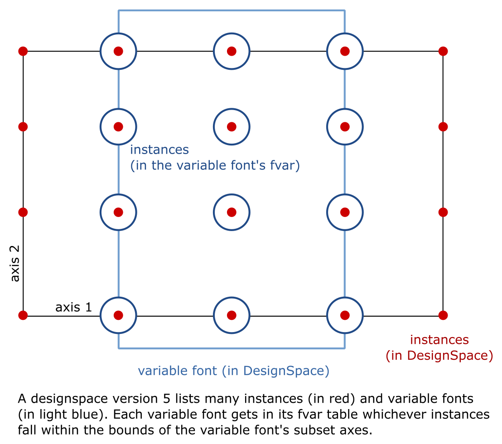

.. _document-xml-structure:

**********************
Document XML structure
**********************

.. sectnum::
   :start: 2
.. Note: impossible with Sphinx to avoid numbering the document title
.. See this issue: https://github.com/sphinx-doc/sphinx/issues/4628

.. contents:: Table of contents (levels match the document structure)
   :local:

========
Overview
========

.. code:: xml

    <?xml version='1.0' encoding='utf-8'?>
    <designspace format="5.1">
        <axes>
            <!-- define axes here -->
            <axis... />
            <mappings>
                <!-- define axis mappings here -->
                <!-- New in version 5.1 -->
                <mapping... />
            </mappings>
        </axes>
        <labels>
            <!-- define STAT format 4 labels here -->
            <!-- New in version 5.0 -->
            <label... />
        </labels>
        <sources>
            <!-- define masters here -->
            <source... />
        </sources>
        <variable-fonts>
            <!-- define variable fonts here -->
            <!-- New in version 5.0 -->
            <variable-font... />
        </variable-fonts>
        <instances>
            <!-- define instances here -->
            <instance... />
        </instances>
        <rules>
            <!-- define rules here -->
            <rule... />
        </rules>
        <lib>
            <dict>
                <!-- store custom data here -->
            </dict>
        </lib>
    </designspace>

==================
``<axes>`` element
==================

The ``<axes>`` element contains one or more ``<axis>`` elements.

.. rubric:: Attributes

- ``elidedfallbackname``: optional, string.
  STAT Style Attributes Header field ``elidedFallbackNameID``.
  See: `OTSpec STAT Style Attributes Header
  <https://docs.microsoft.com/en-us/typography/opentype/spec/stat#style-attributes-header>`_

  .. versionadded:: 5.0

``<axis>`` element
==================

-  Define a single axis
-  Child element of ``axes``
-  The axis can be either continuous (as in version 4.0) or discrete (new in version 5.0).
   Discrete axes have a list of values instead of a range minimum and maximum.

.. rubric:: Attributes

-  ``name``: required, string. Name of the axis that is used in the
   location elements.
-  ``tag``: required, string, 4 letters. Some axis tags are registered
   in the OpenType Specification.
-  ``default``: required, number. The default value for this axis, in user space coordinates.
-  ``hidden``: optional, 0 or 1. Records whether this axis needs to be
   hidden in interfaces.

For a continuous axis:
   -  ``minimum``: required, number. The minimum value for this axis, in user space coordinates.
   -  ``maximum``: required, number. The maximum value for this axis, in user space coordinates.

For a discrete axis:
   -  ``values``: required, space-separated numbers. The exhaustive list of possible values along this axis.

   .. versionadded:: 5.0

.. rubric:: Example

.. code:: xml

    <axis name="weight" tag="wght" minimum="1" maximum="1000" default="400">

    <!--
      Discrete axes provide a list of discrete values.
      No interpolation is allowed between these.
    -->
    <axis name="Italic" tag="ital" default="0" values="0 1">

.. _labelname:

``<labelname>`` element (axis)
------------------------------

-  Defines a human readable name for UI use.
-  Optional for non-registered axis names.
-  Can be localised with ``xml:lang``
-  Child element of ``<axis>`` or ``<label>``

.. rubric:: Attributes

-  ``xml:lang``: required, string. `XML language
   definition <https://www.w3.org/International/questions/qa-when-xmllang.en>`__

.. rubric:: Value

-  The natural language name of this axis or STAT label.

.. rubric:: Example

.. code:: xml

    <labelname xml:lang="fa-IR">قطر</labelname>
    <labelname xml:lang="en">Wéíght</labelname>

``<map>`` element
-----------------

-  Defines a single node in a series of input value (user space coordinate)
   to output value (designspace coordinate) pairs.
-  Together these values transform the designspace.
-  Child of ``<axis>`` element.

.. rubric:: Example

.. code:: xml

    <map input="1.0" output="10.0" />
    <map input="400.0" output="66.0" />
    <map input="1000.0" output="990.0" />

``<labels>`` element (axis)
---------------------------

The ``<labels>`` element contains one or more ``<label>`` elements, and can
indicate this axis' STAT ordering.

.. versionadded:: 5.0

.. rubric:: Attributes

- ``ordering``: optional, int, default: natural position of this axis in the list
  of axes. STAT table field ``axisOrdering`` for this axis.

  See: `OTSpec STAT Axis Record <https://docs.microsoft.com/en-us/typography/opentype/spec/stat#axis-records>`_

``<label>`` element (axis)
..........................

-  Define STAT format 1, 2, 3 labels for the locations on this axis.
-  The axis can have several child ``<label>`` elements, one for each STAT entry.
-  This ``<label>`` element can have several ``<labelname>`` child elements,
   to provide translations of its ``name`` attribute.

.. versionadded:: 5.0

.. rubric:: Attributes

- ``name``: required, string. the name of this label
- ``elidable``: optional, boolean, default: false. STAT flag ``ELIDABLE_AXIS_VALUE_NAME``.
- ``oldersibling``: optional, boolean, default: false. STAT flag ``OLDER_SIBLING_FONT_ATTRIBUTE``.

  See: `OTSpec STAT Flags <https://docs.microsoft.com/en-us/typography/opentype/spec/stat#flags>`_

Depending on the intended target STAT format, use a combination of the following
field, all in user coordinates. Check the following table for the format
correspondences.

- ``uservalue``: (required) STAT field ``value`` (format 1, 3) or ``nominalValue`` (format 2).
- ``userminimum``: STAT field ``rangeMinValue`` (format 2).
- ``usermaximum``: STAT field ``rangeMaxValue`` (format 2).
- ``linkeduservalue``: STAT field ``linkedValue`` (format 3).

===========  =========  ===========  ===========  ===============
STAT Format  uservalue  userminimum  usermaximum  linkeduservalue
===========  =========  ===========  ===========  ===============
1            ✅          ❌            ❌            ❌
2            ✅          ✅            ✅            ❌
3            ✅          ❌            ❌            ✅
===========  =========  ===========  ===========  ===============

.. rubric:: Example

.. code:: xml

    <label userminimum="200" uservalue="200" usermaximum="250" name="Extra Light">
        <labelname xml:lang="de">Extraleicht</labelname>
        <labelname xml:lang="fr">Extra léger</labelname>
    </label>
    <label userminimum="350" uservalue="400" usermaximum="450" name="Regular" elidable="true" />

``<labelname>`` element (axis STAT label)
,,,,,,,,,,,,,,,,,,,,,,,,,,,,,,,,,,,,,,,,,

User-facing translations of this STAT label. Keyed by ``xml:lang`` code.

.. versionadded:: 5.0

Same attribute and value as :ref:`the axis' \<labelname\> element <labelname>`.

Example of all axis elements together
=====================================

.. code:: xml

    <axes elidedfallbackname="Regular">
        <axis default="1" maximum="1000" minimum="0" name="weight" tag="wght">
            <labelname xml:lang="fa-IR">قطر</labelname>
            <labelname xml:lang="en">Wéíght</labelname>
            <labels>
                <label userminimum="200" uservalue="200" usermaximum="250" name="Extra Light">
                    <labelname xml:lang="de">Extraleicht</labelname>
                    <labelname xml:lang="fr">Extra léger</labelname>
                </label>
                <label userminimum="350" uservalue="400" usermaximum="450" name="Regular" elidable="true" />
            </labels>
        </axis>
        <axis default="100" maximum="200" minimum="50" name="width" tag="wdth">
            <map input="50.0" output="10.0" />
            <map input="100.0" output="66.0" />
            <map input="200.0" output="990.0" />
        </axis>
    </axes>

``<mappings>`` element
======================

-  Define axis mappings.
-  Child element of ``axes``

 .. versionadded:: 5.1

``<mapping>`` element
---------------------

-  Defines an axis mapping.
-  Child element of ``<mappings>``

 .. versionadded:: 5.1

``<input>`` element
...................

-  Defines the input location of an axis mapping.
-  Child element of ``<mapping>``
-  Contains one or more ``<dimension>`` elements with designspace locations.

 .. versionadded:: 5.1

``<output>`` element
...................

-  Defines the output location of an axis mapping.
-  Child element of ``<mapping>``
-  Contains one or more ``<dimension>`` elements with designspace locations.

 .. versionadded:: 5.1

Example of all mappings elements together
=========================================

.. code:: xml

    <mappings>
        <mapping>
            <input>
                <dimension name="weight" xvalue="900"/>
                <dimension name="width" xvalue="150"/>
            </input>
            <output>
                <dimension name="weight" xvalue="870"/>
            </output>
        </mapping>
    </mappings>

================================
``<labels>`` element (top-level)
================================

The ``<labels>`` element contains one or more ``<label>`` elements.

.. versionadded:: 5.0

``<label>`` element (top-level)
===============================

-  Define STAT format 4 labels for a free-standing location.
-  The designspace can have several top-level ``<label>`` elements, one for each
   STAT format 4 entry.
-  This ``<label>`` element must have a child ``<location>`` element that
   represents the location to which the label applies.
-  This ``<label>`` element may have several child ``<labelname>`` elements to
   provide translations of its ``name`` attribute.

See: `OTSpec STAT Axis value table, format 4 <https://docs.microsoft.com/en-us/typography/opentype/spec/stat#axis-value-table-format-4>`_

.. versionadded:: 5.0

.. rubric:: Attributes

- ``name``: required, string. the name of this label
- ``elidable``: optional, boolean, default: false. STAT flag ``ELIDABLE_AXIS_VALUE_NAME``.
- ``oldersibling``: optional, boolean, default: false. STAT flag ``OLDER_SIBLING_FONT_ATTRIBUTE``.

  See: `OTSpec STAT Flags <https://docs.microsoft.com/en-us/typography/opentype/spec/stat#flags>`_

.. _location:

``<location>`` element (top-level STAT label)
---------------------------------------------

-  Defines a coordinate in either user or design space.
-  Encodes a dictionary of ``{ axisname: axisvalue }``.
-  Also used in ``<source>``, ``<instance>`` and ``<glyph>`` elements.
-  This ``<location>`` element must have one or more child ``<dimension>``
   elements.

.. _dimension:

``<dimension>`` element
.......................

-  Child element of ``<location>``, ``input``, or ``output`` elements

.. rubric:: Attributes

-  ``name``: required, string. Name of the axis.

Depending on whether you're representing a location in user or design coordinates,
provide one of the attributes below.

For user-space coordinates:

-  ``uservalue``: required, number. The value on this axis in user coordinates.

   .. versionadded:: 5.0

For design-space coordinates:

-  ``xvalue``: required, number. The value on this axis in design coordinates.
-  ``yvalue``: optional, number. Separate value for anisotropic interpolations.

.. rubric:: Example

.. code:: xml

    <location>
        <dimension name="Width" uservalue="125" />
        <dimension name="Weight" xvalue="10" yvalue="20.5" />
    </location>

``<labelname>`` element (top-level STAT label)
----------------------------------------------

User-facing translations of this STAT label. Keyed by ``xml:lang`` code.

.. versionadded:: 5.0

Same attribute and value as :ref:`the axis' \<labelname\> element <labelname>`.

.. _rules-element:

===================
``<rules>`` element
===================

The ``<rules>`` element contains one or more ``<rule>`` elements.

The rules are evaluated in this order.

Rules describe designspace areas in which one glyph should be replaced by another.
A rule has a name and a number of conditionsets. The rule also contains a list of
glyphname pairs: the glyphs that need to be substituted. For a rule to be triggered
**only one** of the conditionsets needs to be true, ``OR``. Within a conditionset
**all** conditions need to be true, ``AND``.

.. rubric:: Attributes

-  ``processing``: flag, optional. Valid values are [``first``, ``last``]. This
   flag indicates whether the substitution rules should be applied before or after
   other glyph substitution features.

   -  If no ``processing`` attribute is given, interpret as ``first``, and put
      the substitution rule in the ``rvrn`` feature.
   -  If ``processing`` is ``last``, put it in ``rclt``.
   -  The default is ``first``. For new projects, you probably want ``last``.
      See the following issues for more information:
      `fontTools#1371 <https://github.com/fonttools/fonttools/issues/1371#issuecomment-590214572>`__
      `fontTools#2050 <https://github.com/fonttools/fonttools/issues/2050#issuecomment-678691020>`__
   -  If you want to use a different feature altogether, e.g. ``calt``,
      use the lib key ``com.github.fonttools.varLib.featureVarsFeatureTag``

      .. code:: xml

           <lib>
               <dict>
                   <key>com.github.fonttools.varLib.featureVarsFeatureTag</key>
                   <string>calt</string>
               </dict>
           </lib>

``<rule>`` element
==================

-  Defines a named rule.
-  Each ``<rule>`` element contains one or more ``<conditionset>`` elements.
-  **Only one** ``<conditionset>`` needs to be true to trigger the rule (logical OR). An empty condition set is considered to be true, as in, the rule will be always-on.
-  **All** conditions in a ``<conditionset>`` must be true to make the ``<conditionset>`` true. (logical AND)
-  For backwards compatibility a ``<rule>`` can contain ``<condition>`` elements outside of a conditionset. These are then understood to be part of a single, implied, ``<conditionset>``. Note: these conditions should be written wrapped in a conditionset.
-  A rule element needs to contain one or more ```` elements in order to be compiled to a variable font.
-  Rules without sub elements should be ignored when compiling a font.
-  For authoring tools it might be necessary to save designspace files without ```` elements just because the work is incomplete.

.. rubric:: Attributes

-  ``name``: optional, string. A unique name that can be used to
   identify this rule if it needs to be referenced elsewhere. The name
   is not important for compiling variable fonts.

``<conditionset>`` element
--------------------------

-  Child element of ``<rule>``
-  Contains zero or more ``<condition>`` elements.

``<condition>`` element
.......................

-  Child element of ``<conditionset>``
-  Between the ``minimum`` and ``maximum`` this condition is ``True``.
-  ``minimum`` and ``maximum`` are in designspace coordinates.
-  If ``minimum`` is not available, assume it is ``axis.minimum``, mapped to designspace coordinates.
-  If ``maximum`` is not available, assume it is ``axis.maximum``, mapped to designspace coordinates.
-  The condition must contain at least a minimum or maximum or both.

.. rubric:: Attributes

-  ``name``: string, required. Must match one of the defined ``axis``
   name attributes.
-  ``minimum``: number, required*. The low value, in design coordinates.
-  ``maximum``: number, required*. The high value, in design coordinates.

.. If you want to specify the condition limits in design coordinates:

.. If you want to specify the condition limits in user coordinates:

.. -  ``userminimum``: number, required*. The low value, in design coordinates.
.. -  ``usermaximum``: number, required*. The high value, in design coordinates.

```` element
-----------------

-  Child element of ``<rule>``.
-  Defines which glyph to replace when the rule evaluates to **True**.
-  The ```` element contains a pair of glyphnames. The ``name`` attribute is the glyph that should be visible when the rule evaluates to **False**. The ``with`` attribute is the glyph that should be visible when the rule evaluates to **True**.

.. rubric:: Attributes

-  ``name``: string, required. The name of the glyph this rule looks
   for.
-  ``with``: string, required. The name of the glyph it is replaced
   with.

.. rubric:: Example

Example with an implied ``<conditionset>``. Here the conditions are not
contained in a conditionset.

.. code:: xml

    <rules processing="last">
        <rule name="named.rule.1">
            <condition minimum="250" maximum="750" name="weight" />
            <condition minimum="50" maximum="100" name="width" />
            
        </rule>
    </rules>

Example with ``<conditionsets>``. All conditions in a conditionset must be true.

.. code:: xml

    <rules>
        <rule name="named.rule.2">
            <conditionset>
                <condition minimum="250" maximum="750" name="weight" />
                <condition minimum="50" maximum="100" name="width" />
            </conditionset>
            <conditionset>
                <condition... />
                <condition... />
            </conditionset>
            
        </rule>
    </rules>

=====================
``<sources>`` element
=====================

The ``<sources>`` element contains one or more ``<source>`` elements.

``<source>`` element
====================

-  Defines a single font or layer that contributes to the designspace.
-  Child element of ``<sources>``
-  Location in designspace coordinates.

.. rubric:: Attributes

-  ``familyname``: optional, string. The family name of the source font.
   While this could be extracted from the font data itself, it can be
   more efficient to add it here.
-  ``stylename``: optional, string. The style name of the source font.
-  ``name``: optional, string. A unique name that can be used to
   identify this font if it needs to be referenced elsewhere.
-  ``filename``: required, string. A path to the source file, relative
   to the root path of this document. The path can be at the same level
   as the document or lower.
-  ``layer``: optional, string. The name of the layer in the source file.
   If no layer attribute is given assume the foreground layer should be used.

``<familyname>`` element: localised names for sources
-----------------------------------------------------

Localised family names for sources can be included with this ``<familyname>``
element with an ``xml:lang`` attribute:
`XML language definition <https://www.w3.org/International/questions/qa-when-xmllang.en>`__

.. versionadded:: 5.0

.. rubric:: Example

.. code:: xml

    <familyname xml:lang="fr">Montserrat</familyname>
    <familyname xml:lang="ja">モンセラート</familyname>

``<location>`` element (source)
-------------------------------

Defines the coordinates of this source in the design space.

.. seealso:: :ref:`Full documentation of the \<location\> element <location>`

``<dimension>`` element (source)
................................

.. seealso:: :ref:`Full documentation of the \<dimension\> element <dimension>`

``<lib>`` element (source)
--------------------------

-  Example: ``<lib copy="1" />``
-  Child element of ``<source>``
-  Defines if the instances can inherit the data in the lib of this source.
-  MutatorMath only.

.. deprecated:: 5.0

.. note::

    Don't confuse with other ``<lib>`` elements which allow storing
    arbitrary data. Sources don't have such a ``<lib>`` because usually the
    backing UFO file has one itself.

``<info>`` element
------------------

-  Example: ``<info copy="1" />``
-  Child element of ``<source>``
-  Defines if the instances can inherit the non-interpolating font info
   from this source.
-  MutatorMath only.

.. deprecated:: 5.0

``<features>`` element
----------------------

-  Example: ``<features copy="1" />``
-  Defines if the instances can inherit opentype feature text from this
   source.
-  Child element of ``<source>``
-  MutatorMath only.

.. deprecated:: 5.0

``<glyph>`` element (source)
----------------------------

-  Example: ``<glyph mute="1" name="A"/>``
-  In a ``<source>`` element this states if a glyph is to be excluded from
   the calculation.
-  MutatorMath only.

.. rubric:: Attributes

-  ``mute``: optional attribute, number 1 or 0. Indicate if this glyph
   should be ignored as a master.

.. note::

    Do not confuse with the ``<glyph>`` element in instances, which achieves
    something different.

.. _kerning_source:

``<kerning>`` element (source)
------------------------------

-  Example: ``<kerning mute="1" />``
-  Can appear in ``<source>`` as well as in ``<instance>`` elements.
-  MutatorMath only.

.. rubric:: Attributes

-  ``mute``: required attribute, number 1 or 0. Indicate if the kerning
   data from this source is to be excluded from the calculation.

   -  If the kerning element is not present, assume ``mute=0``, yes,
      include the kerning of this source in the calculation.

.. rubric:: Example

.. code:: xml

    <source familyname="MasterFamilyName" filename="masters/masterTest1.ufo" name="master.ufo1" stylename="MasterStyleNameOne">
        <location>
            <dimension name="width" xvalue="0.000000" />
            <dimension name="weight" xvalue="0.000000" />
        </location>
        <glyph mute="1" name="A" />
        <glyph mute="1" name="Z" />
    </source>

============================
``<variable-fonts>`` element
============================

The ``<variable-fonts>`` element contains one or more ``<variable-font>`` elements.

.. versionadded:: 5.0

``<variable-font>`` element
===========================

- Child of ``<variable-fonts>``
- Describe a variable font that can be built from an interpolating subset of
  the design space.
- The document may have zero to many variable fonts.

  - If no variable fonts are defined, and all the axes are continuous, then we
    assume, as in version 4 of the format, that the whole document describes
    one variable font covering the whole space.

- Each variable font covers a subset of the whole designspace, defined using
  ``<axis-subset>`` elements.
- Each variable font can have custom associated data using a ``<lib>`` element.

.. versionadded:: 5.0

.. rubric:: Attributes

- ``name``: string, required. Each variable font has a name, that can be
  used by build tools to refer to the font that gets built from this element.
- ``filename``: string, optional. This filename will be used by tools to decide
  where to store the built font on the disk. If not given, a filename can be
  computed from the ``name``. The filename may include an extension (e.g.
  `.ttf`) and the build tools can replace that extension with another (e.g.
  `.otf` or `.woff2`) as needed.

.. rubric:: Example

.. code:: xml

    <variable-font name="MyFontVF_Italic">
      <axis-subsets>
        <axis-subset name="Weight"/>
        <axis-subset name="Italic" uservalue="1"/>
      </axis-subsets>
    </variable-font>

``<axis-subsets>`` element
--------------------------

- Child of ``<variable-font>``
- Defines the portion of the design space that this variable font covers.
- Each axis that you want to include in the VF needs to be mentioned here.
- Not mentioning an axis is equivalent to slicing the space at the default
  value of that axis.

.. versionadded:: 5.0

``<axis-subset>`` element
.........................

- Child of ``<axis-subsets>``
- Defines the subset of one axis, by ``name=""``, that the variable font covers.
- If this axis is continuous, the VF can either cover:

  1. the whole axis

     .. code:: xml

        <axis-subset name="Weight"/>

  2. a sub-range of the full axis

     .. code:: xml

        <axis-subset name="Weight" userminimum="400" usermaximum="500" userdefault="400"/>

  3. a specific value along that axis; then the axis is not functional in the VF
     but the design space is sliced at the given location. *Note:* While valid to have a
     specific value that doesn’t have a matching ``<source>`` at that value, currently there
     isn’t an implentation that supports this. See `this fontmake issue
     <https://github.com/googlefonts/fontmake/issues/920>`.

     .. code:: xml

        <!-- Make a bold VF -->
        <axis-subset name="Weight" uservalue="700"/>

- If this axis is discrete, then only the third option above is possible:
  give one value along the axis.

  .. code:: xml

      <!-- Make an italic VF -->
      <axis-subset name="Italic" uservalue="1"/>

.. versionadded:: 5.0

.. rubric:: Attributes

- ``name``: required, string. Name of the axis to subset.

When defining a range:

- ``userminimum``: optional, number.
  Lower end of the range, in user coordinates.
  If not mentioned, assume the axis's minimum.
- ``usermaximum``: optional, number.
  Upper end of the range, in user coordinates.
  If not mentioned, assume the axis's maximum.
- ``userdefault``: optional, number.
  New default value of subset axis, in user coordinates.
  If not mentioned, assume the axis's default.
  If the axis's default falls outside of the subset range, then the new default
  will be the extremum that is closest to the full axis's default.

When defining a single value:

- ``uservalue``: required, number.
  Single value, in user coordinates, at which to snapshot the design space
  while building this VF.

``<lib>`` element (variable font)
---------------------------------

Arbitrary data about this variable font.

.. versionadded:: 5.0

.. seealso:: :ref:`lib`

Instances included in the variable font
---------------------------------------

         variable font gets in its fvar table whichever instances fall within
         the bounds of the variable font's subset axes.

   Illustration of instances included in a variable font.

=======================
``<instances>`` element
=======================

The ``<instances>`` element contains one or more ``<instance>`` elements.

``<instance>`` element
======================

-  Defines a single font that can be calculated with the designspace.
-  Child element of ``<instances>``
-  For use in varLib the instance element really only needs the names
   and the location. The ``<glyphs>`` element is not required.
-  MutatorMath uses the ``<glyphs>`` element to describe how certain
   glyphs need different masters, mainly to describe the effects of
   conditional rules in Superpolator.
-  Location in designspace coordinates.

.. rubric:: Attributes

-  ``familyname``: required, string. The family name of the instance
   font. Corresponds with ``font.info.familyName``
-  ``stylename``: required, string. The style name of the instance font.
   Corresponds with ``font.info.styleName``
-  ``name``: required, string. A unique name that can be used to
   identify this font if it needs to be referenced elsewhere.
-  ``filename``: string. Required for MutatorMath. A path to the
   instance file, relative to the root path of this document. The path
   can be at the same level as the document or lower.
-  ``postscriptfontname``: string. Optional for MutatorMath. Corresponds
   with ``font.info.postscriptFontName``
-  ``stylemapfamilyname``: string. Optional for MutatorMath. Corresponds
   with ``styleMapFamilyName``
-  ``stylemapstylename``: string. Optional for MutatorMath. Corresponds
   with ``styleMapStyleName``
-  ``location``: string. Optional. Describes the location of this instance,
   taking it from the root level ``<labels>`` (STAT format 4) element with the
   same name as the string.

   .. versionadded:: 5.0

``<location>`` element (instance)
---------------------------------

Defines the coordinates of this instance in the design space.

.. seealso:: :ref:`Full documentation of the \<location\> element <location>`

``<dimension>`` element (instance)
..................................

.. seealso:: :ref:`Full documentation of the \<dimension\> element <dimension>`

``<lib>`` element (instance)
----------------------------

Arbitrary data about this instance.

.. seealso:: :ref:`lib`

``<stylename>``, ``<familyname>``, ``<stylemapstylename>``, ``<stylemapfamilyname>`` elements: localised names for instances
----------------------------------------------------------------------------------------------------------------------------

Localised names for instances can be included with these simple elements
with an ``xml:lang`` attribute:
`XML language definition <https://www.w3.org/International/questions/qa-when-xmllang.en>`__

-  ``<stylename>``
-  ``<familyname>``
-  ``<stylemapstylename>``
-  ``<stylemapfamilyname>``

.. rubric:: Example

.. code:: xml

    <stylename xml:lang="fr">Demigras</stylename>
    <stylename xml:lang="ja">半ば</stylename>
    <familyname xml:lang="fr">Montserrat</familyname>
    <familyname xml:lang="ja">モンセラート</familyname>
    <stylemapstylename xml:lang="de">Standard</stylemapstylename>
    <stylemapfamilyname xml:lang="de">Montserrat Halbfett</stylemapfamilyname>
    <stylemapfamilyname xml:lang="ja">モンセラート SemiBold</stylemapfamilyname>

Example for varLib
------------------

.. code:: xml

    <instance familyname="InstanceFamilyName" filename="instances/instanceTest2.ufo" name="instance.ufo2" postscriptfontname="InstancePostscriptName" stylemapfamilyname="InstanceStyleMapFamilyName" stylemapstylename="InstanceStyleMapStyleName" stylename="InstanceStyleName">
    <location>
        <dimension name="width" xvalue="400" yvalue="300" />
        <dimension name="weight" xvalue="66" />
    </location>
    <lib>
        <dict>
            <key>com.coolDesignspaceApp.specimenText</key>
            <string>Hamburgerwhatever</string>
        </dict>
    </lib>
    </instance>

Here is an example using STAT format 4 labels to define the location of the
instance directly.

.. code:: xml

    <?xml version='1.0' encoding='utf-8'?>
    <designspace format="5.0">
        <!-- ... -->
        <labels>
            <!-- define STAT format 4 labels here -->
            <!-- New in version 5.0 -->
            <label name="Extra Light">
                <location>
                    <dimension name="weight" uservalue="123" />
                </location>
            </label>
        </labels>
        <!-- ... -->
        <instances>
            <instance filename="instances/labelled.ufo" location="Extra Light" />
        </instances>
    </designspace>

``<glyphs>`` element (instance)
-------------------------------

-  Container for ``<glyph>`` elements.
-  Optional
-  MutatorMath only.

.. deprecated:: 5.0

``<glyph>`` element (instance)
..............................

-  Child element of ``<glyphs>``
-  May contain a ``<location>`` element.

.. deprecated:: 5.0

.. rubric:: Attributes

-  ``name``: string. The name of the glyph.
-  ``unicode``: string. Unicode values for this glyph, in hexadecimal.
   Multiple values should be separated with a space.
-  ``mute``: optional attribute, number 1 or 0. Indicate if this glyph
   should be supressed in the output.

``<note>`` element
,,,,,,,,,,,,,,,,,,

-  String. The value corresponds to glyph.note in UFO.

.. deprecated:: 5.0

``<masters>`` element
,,,,,,,,,,,,,,,,,,,,,

-  Container for ``<master>`` elements
-  These ``<master>`` elements define an alternative set of glyph masters
   for this glyph.

.. deprecated:: 5.0

``<master>`` element
++++++++++++++++++++

-  Defines a single alternative master for this glyph.

.. deprecated:: 5.0

.. rubric:: Attributes

-  ``glyphname``: the name of the alternate master glyph.
-  ``source``: the identifier name of the source this master glyph needs
   to be loaded from

Example for MutatorMath
.......................

.. code:: xml

    <instance familyname="InstanceFamilyName" filename="instances/instanceTest2.ufo" name="instance.ufo2" postscriptfontname="InstancePostscriptName" stylemapfamilyname="InstanceStyleMapFamilyName" stylemapstylename="InstanceStyleMapStyleName" stylename="InstanceStyleName">
    <location>
        <dimension name="width" xvalue="400" yvalue="300" />
        <dimension name="weight" xvalue="66" />
    </location>
    <glyphs>
        <glyph name="arrow2" />
        <glyph name="arrow" unicode="0x4d2 0x4d3">
        <location>
            <dimension name="width" xvalue="100" />
            <dimension name="weight" xvalue="120" />
        </location>
        <note>A note about this glyph</note>
        <masters>
            <master glyphname="BB" source="master.ufo1">
            <location>
                <dimension name="width" xvalue="20" />
                <dimension name="weight" xvalue="20" />
            </location>
            </master>
        </masters>
        </glyph>
    </glyphs>
    <kerning />
    <info />
    <lib>
        <dict>
            <key>com.coolDesignspaceApp.specimenText</key>
            <string>Hamburgerwhatever</string>
        </dict>
    </lib>
    </instance>

.. _lib:

=============================
``<lib>`` element (top-level)
=============================

The ``<lib>`` element contains arbitrary data.

- Child element of ``<designspace>``, ``<variable-font>`` and ``<instance>``
- If present, content must be an XML Property List (plist).
  <https://en.wikipedia.org/wiki/Property_list>__
- Contains arbitrary data about the whole document or about a specific
  variable font or instance.
- Items in the dict need to use **reverse domain name notation**
  <https://en.wikipedia.org/wiki/Reverse_domain_name_notation>__

.. rubric:: Example:

.. code:: xml

    <lib>
        <dict>
            <key>com.company.fontEditor.myString</key>
            <string>The contents use the PLIST format.</string>
        </dict>
    </lib>

